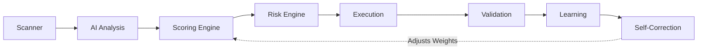

<div align="center">
  
  <h1>🚀 Vyulax AI: Autonomous Quantitative Trading Engine</h1>
  <p>An enterprise-grade, self-correcting algorithmic trading assistant optimized for the National Stock Exchange (NSE) and Bombay Stock Exchange (BSE).</p>
  <p><em>Derived from the Sanskrit <strong>"Vyuh"</strong> (Strategic Matrix/Formation) and <strong>"Laksh"</strong> (Goal/Target) — engineered to hunt and execute high-probability algorithmic targets.</em></p>
</div>

---

## 📖 Executive Overview

Vyulax AI is a sophisticated, highly modular **AI-Driven Stock Market Advisor**. Expanding beyond traditional charting applications, the platform structurally fuses **rigid quantitative mathematical models** (RSI, MACD, Bollinger Bands) with a **Multi-LLM Waterfall Architecture** to actively isolate, validate, and simulate high-probability `Buy` setups in real-time.

Designed for structural resilience, the system features a proprietary **Self-Correction Framework** that autonomously tracks AI strategy performance against execution outcomes—adjusting AI confidence thresholds when predictions drift, and safely filtering assets via strict Long-Only protocols.

---

## ✨ Key Features

* **Multi-LLM Waterfall AI Engine:** Graceful failover across Groq, OpenRouter, and Gemini to ensure 100% uptime.
* **Self-Correcting Learning System:** Autonomously adjusts confidence scoring based on historical win-rates.
* **Advanced Risk Engine:** Integrates Slippage, Drawdown limits, and dynamic Position Sizing.
* **Portfolio Allocation Logic:** Mathematically distributes capital to protect against over-exposure.
* **Real-Time Momentum Scanner:** Sweeps and isolates volatile breakout leaders instantly.
* **Paper Trading Simulation Engine:** Seamless execution tracking simulating real-world brokerage costs.
* **System Health Monitoring Dashboard:** Deep telemetry and Admin-level observability for all AI decisions.

---

## 🧭 System Architecture

The trading pipeline operates across an autonomous, visually synchronized flow:



* **Scanner:** Instantaneously sweeps the NIFTY 500 for massive momentum anomalies and breakout volume.
* **AI Analysis:** The top 6 assets are parsed through a synchronized cascaded LLM pipeline for technical pattern recognition.
* **Scoring Engine:** A strict quantitative rubric (0-100) combining SMAs, RSI, and VPA to approve or reject the setup.
* **Risk Engine:** Computes optimal capital allocation, Stop-Loss floors, and dynamic Take-Profit ceilings.
* **Execution:** Logs the hypothetical position into the Paper Trading Matrix at real-time market prices.
* **Validation:** Continuously ping-syncs open trades against the live data stream.
* **Learning & Self-Correction:** Logs completed trades to adjust the AI's future baseline confidence limits depending on trailing statistical success.

---

---

## 🛠️ Technology Stack

### **Frontend (Client UI)**
- **Framework:** Next.js 14 (App Router)
- **Library:** React 18
- **Styling:** Tailwind CSS & Shadcn UI Components
- **Visualization:** Recharts & Lucide-React

### **Middleware & Backend (Serverless)**
- **Engine:** Node.js Edge / Serverless Functions (Vercel)
- **Authentication:** NextAuth.js (v5) providing secure JWT session handling
- **Database ORM:** Prisma ORM for type-safe database queries
- **Data Providers:** `yahoo-finance2` for native proxy access to real-time market data

### **Artificial Intelligence Pipeline**
- **Primary Generative Engine:** Groq (`llama-3.1-70b-versatile`) for massive token generation.
- **Failover Engines:** OpenRouter API (`meta-llama/llama-3.2-3b-instruct`) and Google Gemini (`gemini-1.5-flash`).

---

## 🛡️ Enterprise Security & Authorization

Security is enforced at the Edge, Middleware, and Database levels to ensure zero-trust compliance for all financial simulation data.

### 1. Zero-Trust Middleware Routing
The application deploys a strict Next.js `middleware.ts` interceptor at the Edge. It actively scans incoming requests to protected routes (`/admin`, `/paper-trading`, `/settings`). If a valid session token is not detected, the user is securely redirected to the login screen before any React code is executed.

### 2. NextAuth v5 Cryptography
- **No Raw Passwords:** Custom credentials are synchronously hashed using high-work-factor `bcrypt`. 
- **Session Tokens:** Generates securely signed Http-Only JWT tokens, making client-side forgery mathematically impossible.

### 3. Database Isolation & RLS (Row Level Security)
- Hosted on Supabase (PostgreSQL), every `Trade` and `DailySystemMetric` row is immutably stamped with an `owner_id`.
- Backend Prisma queries explicitly constrain all sweeps to the active `session.user.id`, structurally preventing cross-tenant data leaks.

### 4. API Key Abstraction & Proxy Routing
- System secrets (`GROQ_API_KEY`, `DATABASE_URL`) are strictly sandboxed inside Vercel's encrypted Environment Variables.
- Internal API routes proxy all real-time data and LLM requests safely, hiding keys and bypassing CORS restrictions.

---

## 📁 Project Structure

```text
ai_stock_advisor/
├── prisma/             # Database Schemas & Migrations
├── public/             # Static Assets & Vyulax Logo
├── src/
│   ├── app/            # Next.js 14 App Router (Pages, API Routes)
│   ├── components/     # React standard/UI components (Tailwind, Shadcn)
│   ├── context/        # React Context (Market & Global States)
│   └── lib/            # Core Architectural Logic:
│       ├── ai/         # Multi-LLM Waterfall configurations
│       ├── trading/    # Quantitative Risk & Scoring engines
│       └── utils.ts    # Structural helpers
├── .env.example        # Environment variable templates
└── package.json        # Dependencies & Build Scripts
```

---

## 🎯 How to Use the Platform

The platform is designed to be fully autonomous, yielding a simplified interface for the end-user.

### Step 1: Account Setup
1. Navigate to `/login` and create a secure profile.
2. In the **Settings Panel**, input your simulated portfolio capital (e.g., ₹1,00,000). The Risk Engine relies on this number to safely divide capital across recommendations.

### Step 2: Running the AI Advisor
1. Navigate to the **Advisor Dashboard**.
2. Select your duration (`Intraday` or `Swing Trade`) and Risk Profile (`Safe`, `Balanced`, `Aggressive`).
3. Click **Generate AI Plan**. 
   - *The system isolates the top 6 explosive gainers from a 50-stock sweep, feeds them to the AI, and enforces a >50/100 Technical Verification Score.*
4. **Review Results:** The UI dynamically populates exact `Buy` targets, Stop-Losses, projected Profit Margins, and specific asset allocation limits.

### Step 3: Executing Paper Trades
1. Click **Save to Paper Trading** beside any high-confidence setup.
2. In the **Portfolio Matrix**, the system tracks hypothetical live positions against the real-time ticker.
3. Upon hitting a limit, the backend automatically squares off the trade, factors in simulated Brokerage Charges, and calculates exact Net PnL.

### Step 4: Monitoring System Health
1. Access the **Admin Telemetry Dashboard** (`/admin/dashboard`).
2. Visually track the AI's effectiveness over rolling 30-day windows.
3. Review clustered anomalies to manually audit the system's hit rate and adjust confidence parameters.

---

## 📊 Performance Metrics (Simulation)

*(Metrics are dynamically tracked within the `/admin/dashboard` panel)*

- **Avg API Response Time:** `[ 2.5s - 4.2s per asset ]`
- **Target Success Rate:** `[ Tracked relative to rolling market regimes ]`
- **System Health Trends:** `[ Dynamically scored 0-100 based on Drawdowns ]`

---

## ⚠️ Current Limitations

- **Market Data Latency:** Real-time data is reliant on scraping nodes, which may experience slight latency compared to institutional terminal feeds.
- **Free API Rate Limits:** Heavily optimized, but prolonged concurrent scanning could trigger rate-limit throttling on free Cloud LLMs.
- **Simulated Execution:** The platform is currently isolated to Paper Trading and is not physically hooked into a live clearinghouse.

---

## 🚀 Roadmap

* 🔌 **Multi-Broker Integration:** Secure OAuth bridging for Zerodha Kite, Upstox, and Groww APIs.
* **Live Automated Execution:** Bridging the internal strategy outputs directly into web-hooked physical buy orders.
* **Advanced Backtesting Engine:** Upload historical tick data to replay the AI's analytical accuracy over decades.
* **Mobile Application:** A dedicated React Native bridge for real-time mobile push notifications of AI setups.
* **Multi-Portfolio Support:** Concurrent trading journals allowing segregated tracking for Intraday vs Swing strategies.

---

### **Disclaimer**
*This platform simulates trading and delivers machine-generated educational mathematical analysis. All projections carry systematic risk, and users assume complete financial responsibility for any real-world capital deployed based on these analytics.*
