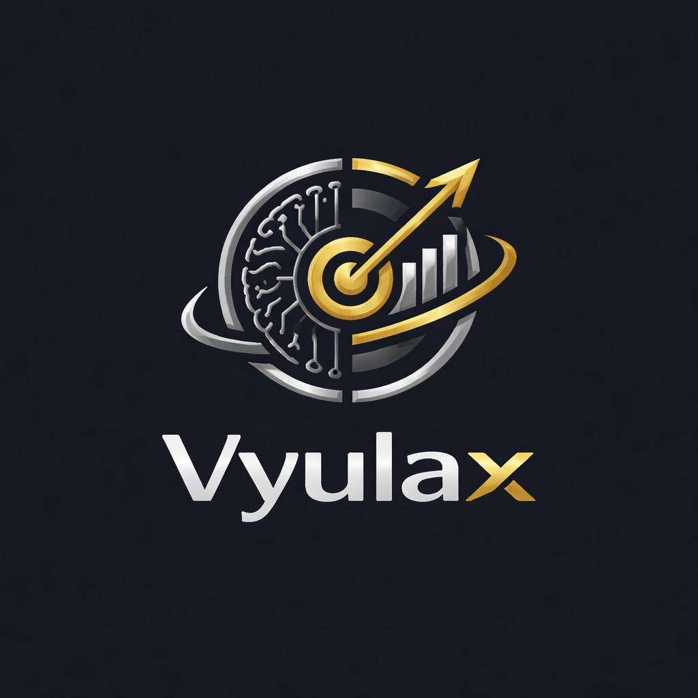
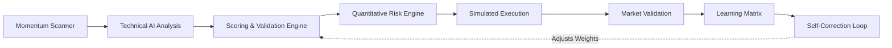

  
  <h1>🚀 Vyulax AI: Autonomous Quantitative Trading Engine</h1>
  
An enterprise-grade, self-correcting algorithmic trading assistant optimized for the National Stock Exchange (NSE) and Bombay Stock Exchange (BSE).

  
<em>Derived from the Sanskrit <strong>"Vyuh"</strong> (Strategic Matrix/Formation) and <strong>"Laksh"</strong> (Goal/Target) — engineered to hunt and execute high-probability algorithmic targets.</em>

  
   
  
  
  
  

---

## 📖 The Problem vs. The Vyulax Solution

Retail traders consistently lose capital because they rely on delayed, emotionally biased human-analysis using lagging retail charting tools. Hedge funds win consistently because they deploy **Multi-Factor Quantitative Models**, automated execution, and zero emotion.

**Vyulax AI levels the playing field.** 
It is a sophisticated SaaS platform that fuses rigid quantitative mathematics (RSI, MACD, Volume Price Analysis) with a **Multi-LLM Waterfall Architecture** to actively isolate, validate, and simulate high-probability `Buy` setups in real-time.

---

## 💎 Enterprise Value Proposition

### 1. Multi-LLM Waterfall AI Engine
Vyulax does not rely on a single point of failure. It utilizes a graceful failover matrix across **Groq (Llama-3)**, **OpenRouter**, and **Google Gemini** to ensure absolute uptime, processing complex global macroeconomic context alongside strict mathematical charting.

### 2. Autonomous Self-Correction Architecture
The platform features a proprietary machine-learning pipeline that autonomously tracks strategy performance against real execution outcomes. When predictions drift, Vyulax mathematically auto-adjusts its confidence thresholds, structurally learning from every single trade.

### 3. Institutional Risk Engine
Risk management is not an afterthought; it is the core constraint. Vyulax natively computes dynamic Slippage, maximum Drawdown limits, and algorithmic Position Sizing to mathematically prevent portfolio ruin. 

### 4. Zero-Trust Paper Trading Simulation
Before touching live capital, users test strategies against the live market using the internal Simulation Engine. The engine actively calculates real-world brokerage costs, taxes, and latency, providing a 1:1 mathematical reflection of live market PnL.

---

## 🧭 System Architecture & Data Flow

The Vyulax backend operates across an autonomous, visually synchronized pipeline:

---

## 🛡️ Bank-Grade Security & Authorization

To protect user trading journals and isolated prediction models, Vyulax AI deploys strict zero-trust SaaS security primitives:

* **Edge Middleware Routing:** Strict Next.js interceptors guarantee unauthenticated requests are physically blocked before server execution.
* **Cryptographic Hashing:** User credentials are synchronously hashed via high-work-factor `bcryptjs`.
* **Row-Level Security (RLS):** Hosted on PostgreSQL, every individual trade and system metric is immutably stamped to a specific `owner_id`. Cross-tenant data leaks are mathematically impossible.
* **Proxy Abstraction:** System API secrets are entirely sandboxed on Serverless Edge functions.

---

## 🎯 Primary Use Cases

### 🏢 For Institutional Quants
Utilize the **Admin Telemetry Dashboard** to visually track AI effectiveness over rolling 30-day windows. Review clustered anomalies, audit the system's hit rate, and adjust confidence parameters securely without touching code.

### 📈 For Swing Traders
Select your Risk Profile (`Safe`, `Balanced`, `Aggressive`). Click **Generate AI Plan**, and let the engine isolate the top 6 explosive momentum gainers from a massive market sweep, enforcing a strict Technical Verification Score before recommending an entry.

### 🎓 For Algorithmic Researchers
Bridge the internal strategy outputs to paper trading and export the `JSON` insights to perfectly test completely automated edge-case theories safely.

---

## 🚀 Product Roadmap

As Vyulax transitions from Closed Beta to Enterprise General Availability, the pipeline includes:

1. **🔌 Multi-Broker Webhook Integration:** Secure OAuth bridging for Zerodha Kite, Upstox, and Groww APIs for direct auto-execution.
2. **📱 Vyulax Mobile App:** A dedicated React Native bridge pushing real-time, low-latency target notifications to iOS/Android.
3. **⏳ Advanced Backtesting Engine:** Upload historical tick-data to replay and stress-test the AI's analytical accuracy over decades of past market crashes.
4. **💼 Multi-Portfolio Management:** Concurrent trading journals allowing segregated tracking for Intraday vs Swing strategies simultaneously.

---

### **Disclaimer**
*Vyulax AI provides simulated trading architectures and delivers machine-generated educational mathematical analysis. All projections carry systematic market risk. Users assume complete financial responsibility for any real-world capital deployed based on these analytics.*
