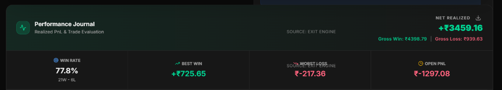

  

  <h1>Vyulax AI</h1>
  
<strong>Autonomous Trading Intelligence. Built for NSE & BSE.</strong>

  
<em>From the Sanskrit — <strong>"Vyuh"</strong> (Strategic Formation) + <strong>"Laksh"</strong> (Target). Built to identify. Built to execute.</em>

   

  
  
  
  

---

## 🎯 What Vyulax Is

Vyulax is a **fully autonomous trading system** — not a signal app, not a screener, not a chatbot.

Every market session, without any human input, it:

- 🔍 **Sweeps 4,600+ NSE equities** in real-time using a high-speed mathematical pre-screener
- 🧠 **Runs each candidate through a full AI advisor pipeline** — technical scoring + multi-LLM validation
- 🛡️ **Passes every approved trade through multiple sequential safety gates** before touching real capital
- ⚡ **Executes directly into Zerodha** — MIS orders for intraday, CNC for swing and long-term
- 🔄 **Closes positions autonomously** — stop-loss exits, target exits, and time-decay exits for intraday
- 🧬 **Learns from its own outcomes** — recalibrates signal weights and strategy parameters after every trade

---

## 💡 Why Vyulax Exists

> ~85–90% of retail traders lose money — not because the market is hard, but because they trade on emotion, ignore risk, and have no consistent framework.

Vyulax was built around one principle:

> **"If the trade is not safe, it doesn't exist."**

The multi-layer risk engine **rejected over 60% of potential trades** before execution in live testing — purely on mathematical validation. That rejection rate is a feature, not a bug.

---

## 📊 Live Performance

This is real. From the live Performance Journal — actual closed trades, tracked by the system:

  

| Metric | Value |
|---|---|
| **Win Rate** | 77.8% (21W / 6L) |
| **Net Realized P&L** | **+₹3,459.16** |
| **Gross Win** | ₹4,398.79 |
| **Gross Loss** | ₹939.63 |
| **Best Single Win** | +₹725.65 |
| **Worst Single Loss** | -₹217.36 |

> These are real closed trades executed by the autonomous system via Zerodha, not paper trades or backtests.

---

## ✨ What's Inside

| Feature | Description |
|---|---|
| **Autonomous Market Sweep** | 4,600+ NSE stocks scanned every cycle with no watchlist required |
| **Market Regime Shield** | BULL/SIDEWAYS/CAUTION/BEAR detection — position sizing adjusts dynamically |
| **Triple-LLM Waterfall AI** | Groq → OpenRouter → Gemini with circuit breakers; guaranteed AI uptime |
| **Intraday Pipeline (MIS)** | Full MIS order lifecycle with time-decay auto-exit |
| **Swing + Long-Term (CNC)** | CNC position management with stop-loss and target tracking |
| **Zerodha Live Integration** | Real-money execution via Kite API — capital sync, holdings sync, order sync |
| **Real-Time WebSocket Ticker** | Live price feed for instant stop-loss detection and breakout triggering |
| **Multi-Gate Risk System** | Daily loss cap, drawdown fuse, sector exposure, correlation guard, wash-trade block |
| **Self-Correction Engine** | Signal weight recalibration + weekly parameter auto-tune from real outcomes |
| **Volume Breakout Detection** | Sub-minute intraday entry trigger from real-time WebSocket volume analysis |
| **Cortex Chat (AI Assistant)** | Natural language: query status, ask about any stock, place sell orders |
| **Predictions Page** | Real-time AI movement probability cards for NSE/BSE stocks |
| **AI Report Card** | Verifies every past prediction against live price — grades AI accuracy with win rate |
| **Performance Journal** | Realized P&L tracking, trade lifecycle cards, win/loss analytics |
| **Live AI Cortex Terminal** | Real-time stream of every AI decision, regime beat, scan, and execution log |
| **System Health Dashboard** | Win rate, AI accuracy, drawdown tracking, broker status, server telemetry |
| **Admin Dashboard** | Platform-wide metrics, user management, live system monitoring |
| **Backtesting Engine** | Replay any strategy against historical NSE data |
| **Advisor Page** | Manual stock deep-dive — AI scorecard, entry/stop-loss/target, fundamentals |
| **Screener** | Real-time NSE momentum screener with sector filtering |
| **Watchlist** | Priority candidates surfaced in every autonomous scan |
| **Paper Trading** | Full simulator — identical pipeline to live, zero real capital at risk |
| **Email Notifications** | Trade alerts, drawdown warnings, weekly auto-tune reports |
| **Bank-Grade Security** | Zero-trust middleware, bcrypt hashing, PostgreSQL Row-Level Security |

---

## 🏛️ Technology Stack

| Layer | Technology |
|---|---|
| **Frontend** | Next.js 15, React 18, Tailwind CSS |
| **Backend** | Next.js API Routes, Prisma ORM |
| **AI** | Groq (Llama-3.3-70B), OpenRouter, Google Gemini — waterfall with circuit breakers |
| **Broker** | Zerodha Kite API (KiteConnect v3) — REST orders + WebSocket live ticks |
| **Market Data** | Zerodha Kite (primary), Yahoo Finance (fundamentals & news) |
| **Database** | Supabase PostgreSQL with Row-Level Security |
| **Auth** | NextAuth.js with bcrypt credential hashing |
| **Infrastructure** | AWS EC2 — custom multi-process backend, proprietary architecture |
| **Job Queue** | AWS SQS FIFO + EventBridge |
| **Email** | Nodemailer |

---

## 🛡️ Security

- **Zero-Trust Middleware** — every route authenticated before execution
- **Cryptographic Password Hashing** — bcryptjs high work-factor
- **Row-Level Security** — PostgreSQL RLS; cross-user data leaks are architecturally impossible
- **Server-Side API Isolation** — all AI keys and broker tokens behind server processes; nothing exposed client-side
- **Atomic Capital Escrow** — capital locked in a DB transaction before broker call; no double-spend race condition possible

---

## 🚀 Try It Live

### 👉 [vyulax.in](https://vyulax.in)

*Create a free account. The AI engine runs immediately — no setup required.*

---

## 🤝 Collaboration & Opportunities

Vyulax is a proprietary, production-grade platform in live beta.

If you're a **trader, investor, fintech builder, or potential partner**, I'm open to:

- 💬 **Feedback** — insights from active traders always welcome
- 🤝 **Partnerships** — broker integrations, data partnerships, co-development
- 📈 **Scaling discussions** — taking this to the next level
- 💼 **Acquisition conversations** — if you're serious, let's talk

> **Reach out via [LinkedIn](https://linkedin.com/in/chaitanya-kumar-botta-297696163)**

🌐 **Live Platform:** [vyulax.in](https://vyulax.in)

I'm not looking for noise — I'm looking for the right conversations.

---

**Built with discipline. Engineered for precision. Designed to survive.**

---

> **Disclaimer:** Vyulax AI delivers algorithmic analysis for educational and research purposes. All trading involves inherent market risk. Users are solely responsible for any real-world capital decisions.
